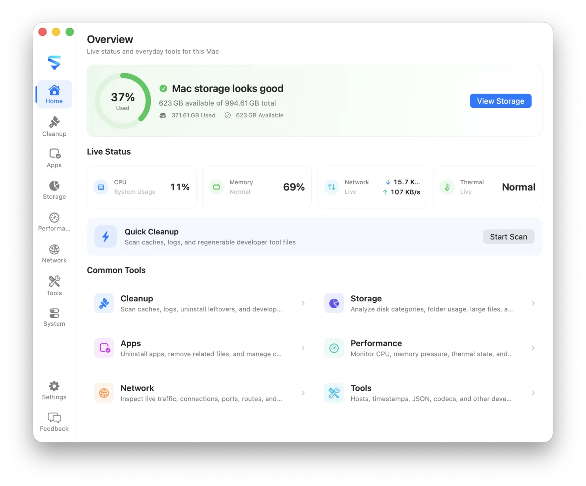

# MachKit

[English](README.md) · [简体中文](README.zh-CN.md)

A privacy-first macOS utility for storage analysis, cleanup, app uninstall, network tools, system inventory, and local developer utilities.

Everything runs locally on your Mac. Scans read file metadata only, risky items stay unchecked by default, and deletions go to the Trash.

<p align="center">
  <table cellpadding="12" cellspacing="0">
    <tr>
      <td align="center" bgcolor="#e8e8ed">
        
      </td>
    </tr>
  </table>
</p>

## Features

- **Cleanup** — Find caches, logs, leftovers, and developer files; risky items stay unchecked
- **Apps** — Browse apps and command-line tools, then uninstall with related support files
- **Storage** — Understand disk usage and large folders
- **Performance** — Monitor CPU, memory pressure, and busy apps
- **Network** — Inspect traffic, connections, listening ports, routes, VPN/TUN, and proxies
- **System** — Review login items, background activity, and extensions
- **Menu bar** — Keep a lightweight monitor for CPU, memory, network speed, and quick actions
- **Developer tools** — Open local utilities from the Tools workspace, menu, or global shortcuts:
  - **Hosts Manager** — View `/etc/hosts` and switch shared / environment mappings safely
  - **Timestamp Converter** — Convert dates and Unix timestamps across units and time zones
  - **JSON Formatter** — Format, minify, sort keys, and query values with path expressions
  - **Codec** — Encode and decode Base64, Base32, Base62, Hex, URL, HTML, Unicode, Escape, and Hash
  - **String Generator** — Generate UUID v1–v7, ULIDs, Nano IDs, hex strings, and passwords locally
  - **Regex Lab** — Highlight matches, inspect capture groups, and try common replacements
  - **Text Diff** — Compare two texts side by side with line-level highlighting
  - **IP / CIDR Calculator** — Calculate IPv4 network details, ranges, and membership checks
  - **Cron Expression** — Build five-field cron schedules and preview upcoming runs
  - **Data Format** — Convert between JSON, YAML, and TOML locally
  - **Color Lab** — Convert HEX, RGB, HSL, and HSV with local contrast checks
  - **QR Code** — Generate QR codes from text or URLs locally
  - **URL Lab** — Parse and rebuild URLs with query and hash editing

## Requirements

- macOS 14 or later
- Xcode 16 / Swift 6 (for building from source)
- Full Disk Access may be required for some user directories
- Editing hosts files requires administrator authentication when writing

## Install

MachKit is currently distributed as an **unsigned** ad-hoc build, so macOS Gatekeeper will block a normal double-click the first time.

1. Download `MachKit-*-macOS.zip` from [GitHub Releases](https://github.com/rhevorn/machkit/releases/latest).
2. Unzip it, then move `MachKit.app` into `/Applications`.
3. Open it with either method:
   - Right-click `MachKit.app` → **Open** → **Open**
   - Or go to **System Settings → Privacy & Security**, find the blocked-app notice, and choose **Open Anyway**
4. After the first successful launch, you can open MachKit normally from Applications or Spotlight.

## Build

Open the Xcode project and run the `MachKit App` scheme:

```bash
open MachKit.xcodeproj
```

Or build from the terminal:

```bash
xcodebuild \
  -project MachKit.xcodeproj \
  -scheme "MachKit App" \
  -configuration Debug \
  -derivedDataPath build/XcodeDerivedData \
  build

open build/XcodeDerivedData/Build/Products/Debug/MachKit.app
```

Core library tests:

```bash
swift test
```

H5 developer tools (optional during UI work):

```bash
cd Tool
npm install
npm run dev
```

Debug builds can load tools from the local Vite server with HMR; Release builds always use the bundled `Resources/WebTools` output. See [Tool/README.md](Tool/README.md) for adding a tool.

## Releases

Local builds use `dev`. Release tags are the source of truth for shipped versions: pushing a tag such as `v0.9.0` overrides the app version with `CFBundleShortVersionString=0.9.0`, while the GitHub Actions run number becomes `CFBundleVersion`. The workflow verifies both values before packaging and publishing the ZIP.

```bash
git tag v0.9.0
git push origin v0.9.0
```

## Localization

English is the source language. The app also includes Simplified Chinese, Traditional Chinese, Japanese, Korean, Spanish, French, German, Brazilian Portuguese, and Russian. Embedded web tools follow the same locale and appearance preferences as the native UI.

## Project layout

```text
App/                 SwiftUI app, preferences, tools shell, and bridges
Sources/MachKitCore/    Scanning, risk rules, cleanup, hosts, and system inventory
Tool/                H5 developer tools (Vite + React), bundled into Resources/WebTools
Resources/           App icon and Localizable.xcstrings
Tests/MachKitCoreTests/ Core behavior and safety tests
MachKit.xcodeproj/      macOS app project
Website/             Marketing site
```

## Contributing

Issues and pull requests are welcome. Keep changes focused, and prefer local, reversible operations for anything that deletes or terminates processes.

## License

[MIT](LICENSE)
